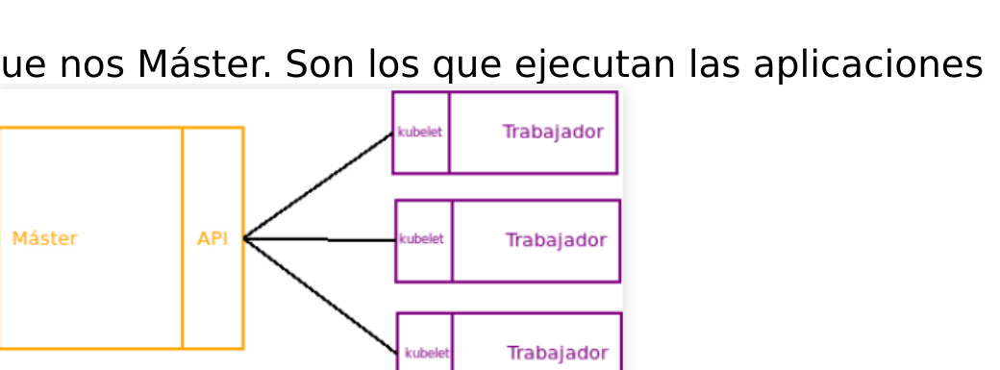
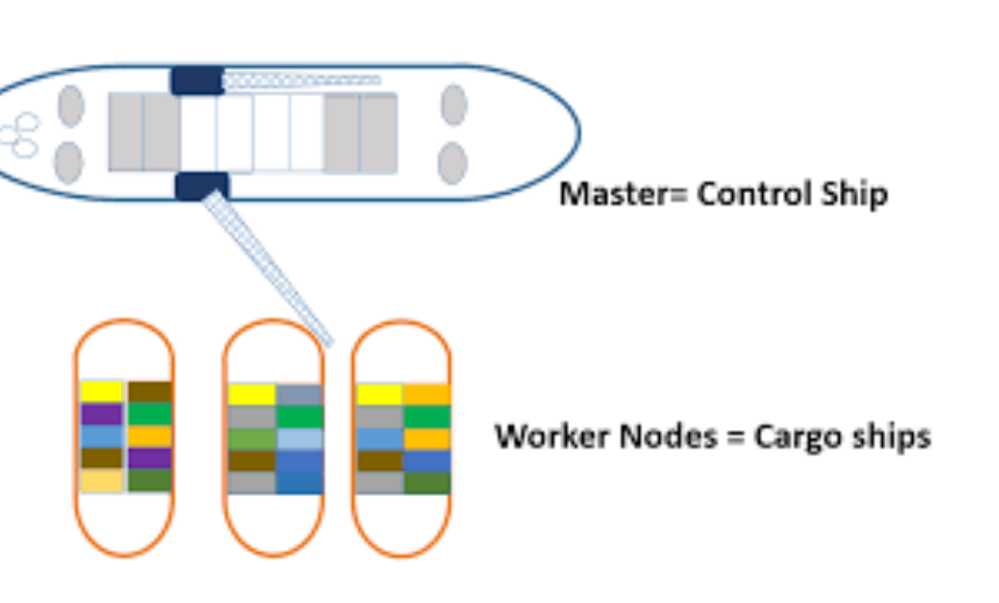

# M01 — Entorno Codespace y kind

[← Página anterior](../../README.md) · [Siguiente página →](M01-01-bootstrap-entorno.md)

> [!NOTE]
> **Cómo funciona este módulo.** Primero la **teoría**, luego la **demostración guiada** del
> formador, y después **practicas tú** en el/los laboratorio(s).

## Qué aprenderás

- Preparar tu fork y Codespace con Docker, kind, kubectl y Helm.
- Distinguir Codespace, Docker, kind y kubectl: qué pieza hace cada trabajo.
- Crear el clúster operativo `k8s-ops` (alta disponibilidad + addons).
- Comprobar que nodos, CNI, Ingress y StorageClass están listos.

## Teoría

Este curso no instala Kubernetes en tu portátil. El **Codespace** es el taller: un Linux con Docker.
**kind** (Kubernetes IN Docker) crea nodos que son contenedores. Cada nodo arranca con **kubeadm**,
igual que un clúster clásico, pero cabe en el Codespace.

| Pieza | Qué es | Qué no es |
|-------|--------|-----------|
| **Codespace** | IDE + terminal + Docker | El clúster |
| **kind** | Fábrica del clúster (contenedores-nodo) | kubectl |
| **kubectl** | Cliente de la API de Kubernetes | El clúster en sí |
| **Helm** | Gestor de paquetes del clúster | Un CNI |

El clúster del curso se llama **`k8s-ops`**. Nace ya como clúster **operativo de laboratorio**:

- 3 nodos control-plane (quórum de etcd) + 2 workers
- CNI **Calico** (NetworkPolicy de verdad)
- **ingress-nginx**, **metrics-server**, StorageClass **local-path**

El control-plane (API) reparte trabajo a los workers, que son quienes ejecutan los contenedores:



> [!NOTE]
> kind no sustituye un datacenter. Sí te deja practicar los **mismos objetos y fallos**
> (API, etcd, Deployments, RBAC) que un administrador ve en un clúster real.
> Las diapos clásicas dibujan **un** máster; `k8s-ops` levanta **tres** para HA.

### Scripts (`scripts/`)

| Script | Qué hace | Cuándo |
|--------|----------|--------|
| `bootstrap-tools.sh` | Instala kind si falta | Automático al crear el Codespace |
| `cluster-up.sh` | Crea `k8s-ops` y aplica addons | Inicio del curso y tras un reset |
| `cluster-down.sh` | Borra el clúster kind | Recuperar un lab destrozado |
| `health-check.sh` | Docker, herramientas, nodos, addons | Tras `cluster-up` y si algo “no va” |

## Demostración guiada

> Recorrido que hace el formador en vivo. Tono descriptivo, sin imperativos.

1. Al abrir el repo en GitHub aparece **Code → Codespaces**. Al crear el Codespace, el
   `postCreate` deja kind, kubectl y Helm en el PATH.
2. En la terminal de la raíz, `./scripts/cluster-up.sh` crea cinco contenedores-nodo y un
   load balancer de API. Mientras Calico no está listo, los nodos se ven `NotReady`.
3. Al terminar, `kubectl get nodes` muestra tres `control-plane` y dos `worker` en `Ready`.
   `./scripts/health-check.sh` resume el mismo estado en una sola pasada.

```text
k8s-ops-control-plane     Ready   control-plane
k8s-ops-control-plane2    Ready   control-plane
k8s-ops-control-plane3    Ready   control-plane
k8s-ops-worker            Ready   <none>
k8s-ops-worker2           Ready   <none>
```

   Analogía visual: el control-plane es el “barco de mando”; los workers, la carga.



## Ahora practica tú

| Lab | Título | Qué harás |
|-----|--------|-----------|
| M01-01 | [Bootstrap del entorno](M01-01-bootstrap-entorno.md) | Fork, Codespace y herramientas |
| M01-02 | [Clúster operativo](M01-02-cluster-operativo.md) | `cluster-up`, nodos y addons |

→ Empieza por **[M01-01 — Bootstrap del entorno](M01-01-bootstrap-entorno.md)**.
