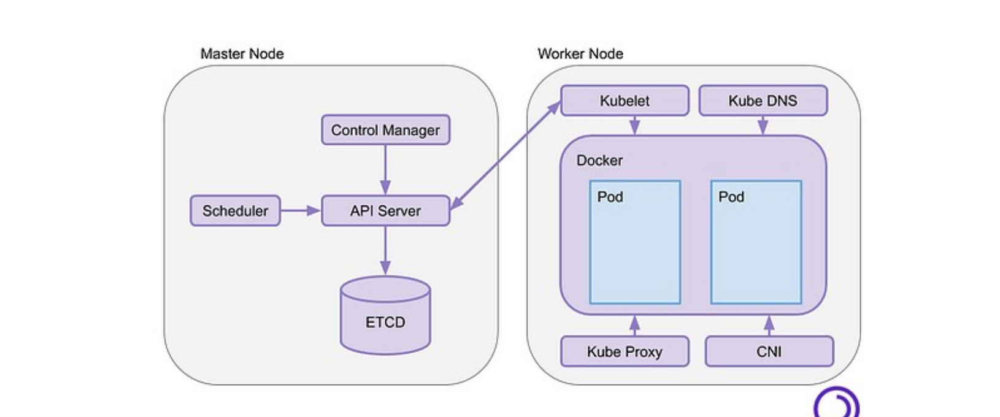

# M02-01 — Arquitectura y API

[← Página anterior](README.md) · [Siguiente página →](M02-02-validar-nodos-sistema.md)

> Práctica del módulo. La teoría y la demo están en el [README del módulo](README.md).

### Objetivo

Identificar en el clúster vivo los componentes del control-plane y comprobar que kubectl habla con la API.

### Prerrequisitos

- Clúster `k8s-ops` Ready ([M01-02](../M01-entorno-codespace-kind/M01-02-cluster-operativo.md)).

### En qué consiste

Inspección de pods estáticos, endpoint de API, grupos `/apis` y ficheros kubeadm dentro del nodo kind.

### 1 — Contexto y versión

**Acción:**

```bash
kubectl config current-context
kubectl version --short 2>/dev/null || kubectl version
```

**Por qué:** Operar el contexto equivocado es el error número uno en un portátil con varios clústeres.

**Resultado esperado:** `kind-k8s-ops` y versión de servidor ~1.32.

### 2 — Pods del control-plane

**Acción:**

```bash
kubectl -n kube-system get pods -o wide | grep -E 'apiserver|etcd|scheduler|controller-manager'
```

**Por qué:** En HA hay **tres** apiserver y **tres** etcd (stacked). El scheduler y el controller-manager también van por nodo de control-plane.

**Resultado esperado:** tres filas de cada componente, `Running`, cada una en un nodo `control-plane*`.



### 3 — La API en crudo

**Acción:**

```bash
kubectl get --raw=/readyz?verbose | tail
kubectl api-resources | head
kubectl api-resources | grep -E 'deployments|networkpolicies|storageclasses'
```

**Por qué:** kubectl es azúcar sobre HTTP. `api-resources` es el mapa de objetos que puedes administrar.

**Resultado esperado:** `readyz` en ok; aparecen `deployments`, `networkpolicies`, `storageclasses`.

### 4 — kubeadm dentro del nodo kind

**Acción:**

```bash
docker exec k8s-ops-control-plane ls /etc/kubernetes
docker exec k8s-ops-control-plane ls /etc/kubernetes/manifests
```

**Por qué:** Esos YAML estáticos son el equivalente a “instalé kubeadm”. kind ya lo hizo; tú lo auditas.

**Resultado esperado:** `admin.conf`, `pki`, `manifests` con `kube-apiserver.yaml`, `etcd.yaml`, etc.

## Comprueba tu entendimiento

**Quién guarda el estado**

`kubectl -n kube-system get pods -l component=etcd -o wide`

→ Tres pods etcd, uno por control-plane.

**Grupos de API**

`kubectl api-versions | grep networking`

→ Al menos `networking.k8s.io/v1` (Ingress, NetworkPolicy).

## Reto

### 1 — Endpoint de la API

```bash
kubectl cluster-info
docker ps --format '{{.Names}}\t{{.Ports}}' | grep -i load
```

¿A qué componente apunta el `Kubernetes control plane` que imprime kubectl?

<details>
<summary>Ver solución</summary>

Al **load balancer** de kind (`k8s-ops-external-load-balancer`), no a un maestro concreto.
Por eso puedes parar un control-plane en M04 y kubectl sigue respondiendo.

</details>

## Errores frecuentes

| Síntoma | Causa probable | Cómo arreglarlo |
|---------|----------------|-----------------|
| `The connection to the server … was refused` | Clúster no creado o contexto mal | `cluster-up.sh` + `kubectl config use-context kind-k8s-ops` |
| Un solo etcd | No es el clúster HA del curso | Revisa `infra/kind/cluster.yaml` (3 control-plane) |
