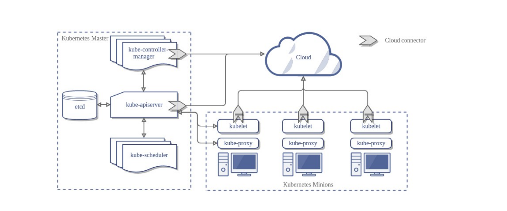
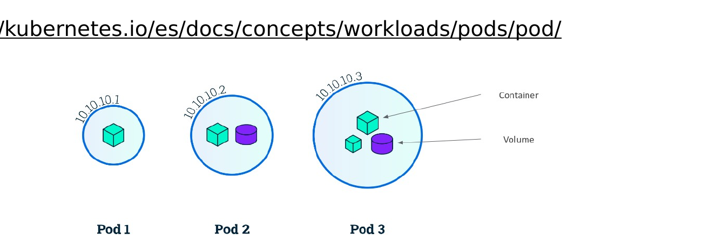
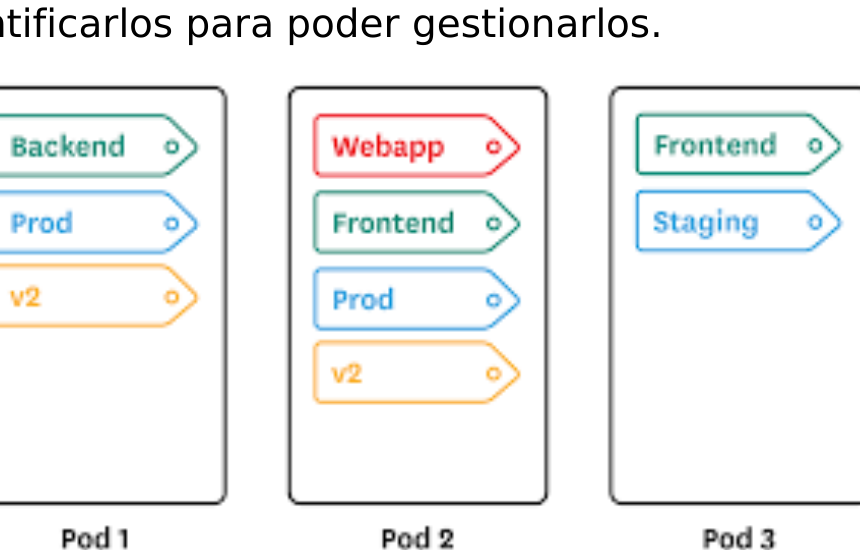
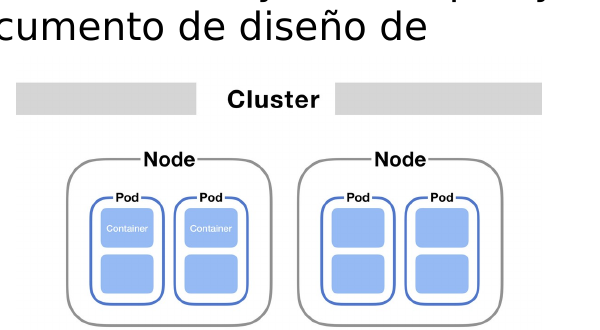

# M02 — Introducción a Kubernetes

[← Página anterior](../M01-entorno-codespace-kind/M01-02-cluster-operativo.md) · [Siguiente página →](M02-01-arquitectura-api.md)

> [!NOTE]
> **Cómo funciona este módulo.** Primero la **teoría**, luego la **demostración guiada** del
> formador, y después **practicas tú** en el/los laboratorio(s).

## Qué aprenderás

- Nombrar los componentes del control-plane y de un nodo worker.
- Explicar qué es la API de Kubernetes y dónde persiste (etcd).
- Inspeccionar nodos, namespaces y pods de sistema con kubectl.
- Relacionar kind + kubeadm: los ficheros de `/etc/kubernetes` dentro del nodo.

## Teoría

Kubernetes (K8s: ocho letras entre la K y la s) es una plataforma de código abierto para
**desplegar, escalar y administrar** aplicaciones en contenedores. Nació en Google y se
donó a la CNCF. Expone una API programática: todo cambio real pasa por ella.

Un clúster es un **plano de control** más unos **nodos** que ejecutan Pods. El orquestador
permite alta disponibilidad, tolerancia a fallos, escalado y cambios en caliente.

| Plano | Componentes | Pregunta que responden |
|-------|-------------|------------------------|
| **Control-plane** | kube-apiserver, etcd, scheduler, controller-manager | ¿Cuál es el estado deseado? ¿Dónde coloco este Pod? |
| **Nodo** | kubelet, kube-proxy (y el runtime de contenedores) | ¿Este Pod está vivo en esta máquina? |
| **Red** | CNI (aquí Calico) + CoreDNS | ¿Cómo se alcanzan los Pods entre nodos? |

**Objetos** (Deployment, Service, Pod…) son documentos JSON/YAML que envías a la API.
**etcd** es el almacén clave-valor: guarda esa verdad. kubectl nunca “habla con Docker”:
habla con el apiserver.

| Pieza | Rol |
|-------|-----|
| **etcd** | Estado del clúster (lo que el API lee y escribe) |
| **kube-apiserver** | Centro de gestión; REST/JSON hacia todos los componentes |
| **kube-controller-manager** | Acerca el estado actual al deseado (réplicas, nodos…) |
| **kube-scheduler** | Elige el nodo donde cae cada Pod |
| **kubelet** | En el nodo: recibe el spec y gestiona los Pods locales |

> [!NOTE]
> **Pod** no es un contenedor suelto: es el átomo de scheduling (uno o más contenedores,
> una IP y, si hace falta, volúmenes compartidos).
> Un **Deployment** no corre él mismo el proceso: crea ReplicaSets que crean Pods.

**Labels y selectors** son pares clave/valor para identificar Pods, Services, etc. y
gestionarlos (el Service y el ReplicaSet “enganchan” por selector, no por nombre de Pod).

Un **nodo** es la máquina de trabajo (antes *minion*): física o virtual. Lleva runtime,
kubelet y kube-proxy. El control-plane los gestiona.

kind arranca cada nodo con **kubeadm**. Por eso en el temario aparece kubeadm *o* kind:
aquí usas kind y **observas** el resultado de kubeadm (`admin.conf`, manifiestos estáticos en
`/etc/kubernetes/manifests`).

## Demostración guiada

> Recorrido que hace el formador en vivo. Tono descriptivo, sin imperativos.

1. Al ejecutar `kubectl get pods -n kube-system`, aparecen `kube-apiserver`, `etcd`,
   `kube-scheduler` y `kube-controller-manager` **en cada control-plane** (estáticos, un
   pod por nodo). Es el diagrama de arquitectura, pero en tres maestros.

2. `kubectl get --raw=/apis | head` muestra grupos de API (`apps`, `networking.k8s.io`…).
   Todo objeto vive en un grupo/versión/recurso.

3. `docker exec k8s-ops-control-plane ls /etc/kubernetes` lista `admin.conf`, `pki/` y
   `manifests/`: es el arranque kubeadm que kind ya hizo.

## Ahora practica tú

| Lab | Título | Qué harás |
|-----|--------|-----------|
| M02-01 | [Arquitectura y API](M02-01-arquitectura-api.md) | Recorrer control-plane, etcd y grupos de API |
| M02-02 | [Validar nodos y sistema](M02-02-validar-nodos-sistema.md) | `describe nodes`, pods de todos los namespaces |

→ Empieza por **[M02-01 — Arquitectura y API](M02-01-arquitectura-api.md)**.
