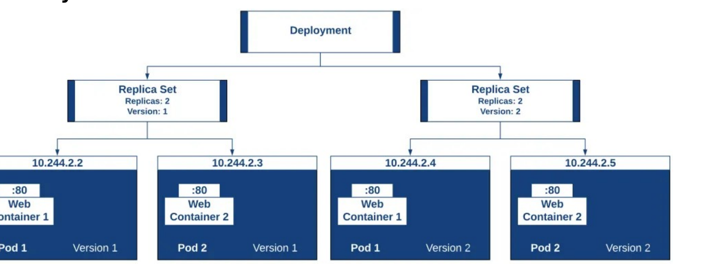

# M03-02 — Rolling update, rollback y escala

[← Página anterior](M03-01-despliegue-config.md) · [Siguiente página →](../M04-diseno-cluster-helm/README.md)

> Práctica del módulo. La teoría y la demo están en el [README del módulo](README.md).

### Objetivo

Actualizar `shop-web` con Rolling Update, revertir si “falla” y escalar réplicas.

### Prerrequisitos

- `shop-web` Running ([M03-01](M03-01-despliegue-config.md)).

### En qué consiste

Cambiar el texto servido (nueva revisión), observar el rollout, deshacerlo y dejar 4 réplicas.

### 1 — Rolling Update

**Acción:**

```bash
kubectl -n shop patch deploy shop-web --type='json' -p='[
  {"op":"replace","path":"/spec/template/spec/containers/0/args","value":["-text=shop-web v2","-listen=:8080"]}
]'
kubectl -n shop rollout status deploy/shop-web
kubectl -n shop get rs
```

**Por qué:** Cambiar la plantilla del Pod crea un ReplicaSet nuevo. `maxUnavailable: 0` mantiene capacidad durante el update.

**Resultado esperado:** `rollout status` ok; un RS antiguo con 0 réplicas y uno nuevo con 2.



### 2 — Verificar la versión

**Acción:**

```bash
kubectl -n shop run curl --rm -it --restart=Never --image=busybox:1.37 -- wget -qO- http://shop-web
kubectl -n shop rollout history deploy/shop-web
```

**Por qué:** El Service no se entera del número de versión: solo de labels. El historial vive en el Deployment.

**Resultado esperado:** respuesta `shop-web v2` y al menos dos revisiones en el history.

### 3 — Rollback

**Acción:**

```bash
kubectl -n shop rollout undo deploy/shop-web
kubectl -n shop rollout status deploy/shop-web
kubectl -n shop run curl --rm -it --restart=Never --image=busybox:1.37 -- wget -qO- http://shop-web
```

**Por qué:** El temario pide rollback “si la actualización falla”. Aquí simulas el fallo revirtiendo a v1 a propósito.

**Resultado esperado:** otra vez `shop-web v1`.

### 4 — Escalado

**Acción:**

```bash
kubectl -n shop scale deploy/shop-web --replicas=4
kubectl -n shop get po
```

**Por qué:** Escalar es cambiar el estado deseado. El HPA (más adelante, métricas) hará lo mismo vía API.

**Resultado esperado:** 4 pods Running. Deja **2** cuando termines: `kubectl -n shop scale deploy/shop-web --replicas=2`.

## Comprueba tu entendimiento

**Eventos del rollout**

`kubectl -n shop describe deploy shop-web | tail -20`

→ ScalingReplicaSet / SuccessfulCreate durante el update.

**Pods en workers**

`kubectl -n shop get po -o wide`

→ Nodos `k8s-ops-worker*`, no necesariamente un único worker.

## Reto

### 1 — Update que no pone Ready

Pon un `readinessProbe` imposible (path `/nope`) y observa que el rollout no termina. Luego deshazlo.

<details>
<summary>Ver solución</summary>

El ReplicaSet nuevo no alcanza Ready; `rollout status` espera. `kubectl -n shop rollout undo deploy/shop-web` vuelve al ReplicaSet anterior. Es el patrón de “error durante la actualización”.

</details>

## Errores frecuentes

| Síntoma | Causa probable | Cómo arreglarlo |
|---------|----------------|-----------------|
| `rollout status` eterno | Probe o imagen mala | `rollout undo` |
| Sigue saliendo v2 tras undo | curl cache / pod curl viejo | `--rm` y repetir wget |
