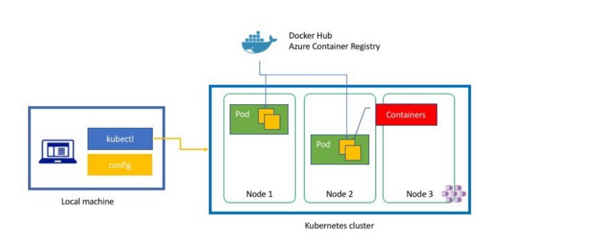
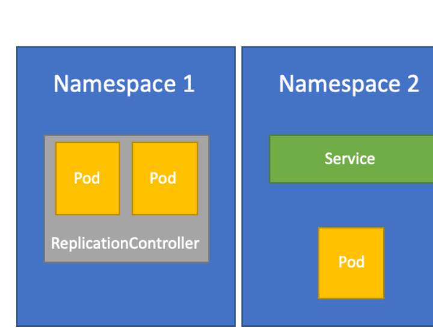

# M03 — Ciclo de vida de aplicaciones

[← Página anterior](../M02-introduccion-kubernetes/M02-02-validar-nodos-sistema.md) · [Siguiente página →](M03-01-despliegue-config.md)

> [!NOTE]
> **Cómo funciona este módulo.** Primero la **teoría**, luego la **demostración guiada** del
> formador, y después **practicas tú** en el/los laboratorio(s).

## Qué aprenderás

- Desplegar una aplicación con Deployment + Service.
- Externalizar config (`ConfigMap`) y secretos (`Secret`).
- Hacer un Rolling Update, comprobar el historial y revertir con rollback.
- Escalar réplicas a mano.

## Teoría

Los objetos básicos (Pod, Service, Volume, Namespace) se combinan en **controladores**:
ReplicaSet, Deployment, StatefulSet, DaemonSet, Job.

| Objeto | Responsabilidad |
|--------|-----------------|
| **Pod** | Instancia en ejecución (efímera). |
| **ReplicaSet** | “Quiero N pods con esta plantilla” (labels/selectors). |
| **Deployment** | Cómo actualizar esa plantilla (rolling, historial, rollback). |
| **ConfigMap** | Config no sensible inyectada como env o fichero. |
| **Secret** | Igual, pero para credenciales (sigue siendo base64, no magia). |
| **Service** | IP/nombre estable delante de pods que nacen y mueren. |
| **Namespace** | Espacio de trabajo (lab `shop`, `payments`, `kube-system`…). |

kubectl aplica YAML (o JSON): el clúster se gobierna **como código**. El cliente habla
con el apiserver; las imágenes salen del registry.

Estrategia **RollingUpdate**: Kubernetes sube pods nuevos y baja los viejos respetando
`maxUnavailable` / `maxSurge`. Cada revisión es un ReplicaSet. Si la versión nueva no
pone `Ready`, `kubectl rollout undo` vuelve al ReplicaSet anterior.

Los **namespaces** aíslan recursos (p. ej. desarrollo vs producción, o `shop` vs `payments`).

> [!WARNING]
> Editar un Pod huérfano o `kubectl delete pod` no cambia el estado deseado: el ReplicaSet crea otro.
> El contrato que debes cambiar es el **Deployment**.

Los nodos son finitos (CPU/RAM). En los manifiestos del curso cada contenedor declara
`resources.requests` y `limits` para no comerse el Codespace.

## Demostración guiada

> Recorrido que hace el formador en vivo.

1. Al aplicar `infra/manifests/m03/shop.yaml` aparece el namespace `shop`, dos réplicas
   `shop-web` y el Service ClusterIP.
2. Un cambio de `args` del contenedor dispara un nuevo ReplicaSet (como el diagrama v1/v2).
   `kubectl -n shop rollout status deploy/shop-web` espera a que los pods nuevos estén Ready.
3. `kubectl -n shop rollout history deploy/shop-web` lista revisiones; `rollout undo` vuelve a la anterior.

## Ahora practica tú

| Lab | Título | Qué harás |
|-----|--------|-----------|
| M03-01 | [Despliegue, ConfigMap y Secret](M03-01-despliegue-config.md) | Publicar `shop-web` |
| M03-02 | [Rolling update, rollback y escala](M03-02-rolling-rollback-escala.md) | Actualizar, revertir y escalar |

→ Empieza por **[M03-01 — Despliegue, ConfigMap y Secret](M03-01-despliegue-config.md)**.
