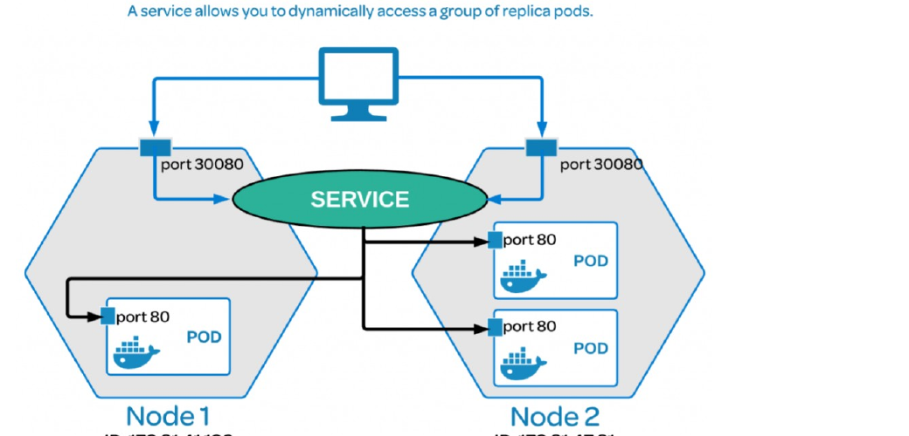

# M05-01 — Services, Ingress y balanceo

[← Página anterior](README.md) · [Siguiente página →](M05-02-networkpolicy.md)

> Práctica del módulo. La teoría y la demo están en el [README del módulo](README.md).

### Objetivo

Exponer `shop-web` por Ingress y comprobar que el Service reparte entre varios Pods.

### Prerrequisitos

- `shop-web` desplegado (M03). Si lo borraste: `kubectl apply -f infra/manifests/m03/shop.yaml`.

### En qué consiste

Endpoints, Ingress `shop.local`, curl desde el Codespace al puerto 8080.

### 1 — Endpoints = backends del balanceo

**Acción:**

```bash
kubectl -n shop scale deploy/shop-web --replicas=3
kubectl -n shop get po,ep,svc -l app=shop-web
```

**Por qué:** kube-proxy (o el dataplane de Calico) balancea a las IPs de Endpoints, no al Deployment.

**Resultado esperado:** tres IPs en `endpoints/shop-web`.



### 2 — Aplicar Ingress y el cliente de red

**Acción:**

```bash
kubectl apply -f infra/manifests/m05/ingress-y-red.yaml
kubectl -n shop get ing shop-web
kubectl -n payments get po
```

**Por qué:** El Ingress engancha host `shop.local` al Service. El namespace `payments` es el blanco del siguiente lab.

**Resultado esperado:** Ingress con ADDRESS (IP del controller) y `payments-api` Running.

### 3 — Entrar por el borde

**Acción:**

```bash
curl -sH 'Host: shop.local' http://127.0.0.1:8080/
```

**Por qué:** En kind no hay DNS público. El hostPort 80 del nodo `ingress-ready` está mapeado a **8080** del Codespace.

**Resultado esperado:** cuerpo `shop-web v1` (o la versión que hayas dejado en M03).

### 4 — ClusterIP desde dentro

**Acción:**

```bash
kubectl -n shop wait --for=condition=Ready pod/netcheck --timeout=60s
kubectl -n shop exec netcheck -- curl -s http://shop-web.shop
```

**Por qué:** Distingue este-oeste (Service) de norte-sur (Ingress). Los dos deben funcionar antes de cerrar con policies.

**Resultado esperado:** el mismo texto de `shop-web`.

## Comprueba tu entendimiento

**Clase de Ingress**

`kubectl -n shop get ing shop-web -o yaml | grep -A2 spec`

→ `ingressClassName: nginx`.

**Puertos del Codespace**

En la pestaña Ports, **8080** aparece como Ingress HTTP.

→ Es el extraPortMapping de `infra/kind/cluster.yaml`.

## Reto

### 1 — Sin cabecera Host

Ejecuta `curl -sv http://127.0.0.1:8080/` y explica el 404 del controller.

<details>
<summary>Ver solución</summary>

nginx no encuentra un server-name que coincida con el Host (IP o localhost). El rule está atado a `shop.local`.

</details>

## Errores frecuentes

| Síntoma | Causa probable | Cómo arreglarlo |
|---------|----------------|-----------------|
| Connection refused :8080 | Ingress controller no Ready | `kubectl -n ingress-nginx get po` |
| 404 | Host incorrecto | `-H 'Host: shop.local'` |
