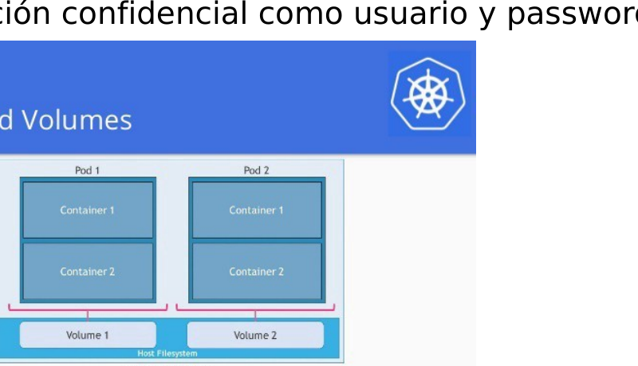

# M08-01 — PVC y StorageClass

[← Página anterior](README.md) · [Siguiente página →](M08-02-statefulset.md)

> Práctica del módulo. La teoría y la demo están en el [README del módulo](README.md).

### Objetivo

Crear un PVC sobre `local-path`, escribir datos y comprobar que sobreviven al borrar el Pod.

### Prerrequisitos

- Namespace `shop`. StorageClass `local-path` (cluster-up).

### En qué consiste

Apply del manifiesto `inventory`, inspección PV/PVC, escritura, delete del Pod, relectura.

### 1 — Clase de almacenamiento

**Acción:**

```bash
kubectl get sc
kubectl get sc local-path -o yaml | grep -A6 provisioner
```

**Por qué:** Sin default class, un PVC sin `storageClassName` se queda Pending. El curso marca `local-path` como default.

**Resultado esperado:** `local-path` con annotation de default y provisioner `rancher.io/local-path`.

### 2 — PVC + app

**Acción:**

```bash
kubectl apply -f infra/manifests/m08/pvc-inventory.yaml
kubectl -n shop get pvc,pv,po -l app=inventory
kubectl -n shop wait --for=condition=Ready pod -l app=inventory --timeout=90s
```

**Por qué:** `WaitForFirstConsumer` enlaza el PV al nodo del Pod, no antes.

**Resultado esperado:** PVC `Bound`, un PV, Pod Running.

### 3 — Escribir dato

**Acción:**

```bash
POD=$(kubectl -n shop get pod -l app=inventory -o jsonpath='{.items[0].metadata.name}')
kubectl -n shop exec "$POD" -- sh -c 'echo hola-persistencia >> /data/log.txt && cat /data/log.txt'
```

**Por qué:** El mount `/data` es el PVC, no el overlay del contenedor.

**Resultado esperado:** el fichero contiene `hola-persistencia` (y el `start` del entrypoint).



### 4 — Matar el Pod y releer

**Acción:**

```bash
kubectl -n shop delete pod -l app=inventory
kubectl -n shop wait --for=condition=Ready pod -l app=inventory --timeout=90s
POD=$(kubectl -n shop get pod -l app=inventory -o jsonpath='{.items[0].metadata.name}')
kubectl -n shop exec "$POD" -- cat /data/log.txt
```

**Por qué:** El ReplicaSet crea un Pod **nuevo**. Si el volumen está bien, el texto sigue.

**Resultado esperado:** `hola-persistencia` sigue en el log. El nombre del Pod **ha cambiado**.

## Comprueba tu entendimiento

**Nodo del PV**

`kubectl -n shop get po -l app=inventory -o wide`

`kubectl get pv -o wide`

→ El volumen está atado al mismo nodo que el Pod (RWO local).

**Qué no sobrevive**

`kubectl -n shop exec "$POD" -- ls /tmp`

→ `/tmp` del contenedor está vacío o distinto: no es el PVC.

## Reto

### 1 — Escalar inventory a 2

`kubectl -n shop scale deploy/inventory --replicas=2` y observa.

<details>
<summary>Ver solución</summary>

El segundo Pod suele quedarse Pending (`Multi-Attach` / volume in use). RWO + Deployment no es el modelo de N réplicas con disco. Eso es el StatefulSet del siguiente lab. Vuelve a `--replicas=1`.

</details>

## Errores frecuentes

| Síntoma | Causa probable | Cómo arreglarlo |
|---------|----------------|-----------------|
| PVC Pending eterno | No hay Pod que lo use | El manifiesto ya incluye el Deployment |
| Dato perdido | Escribiste fuera de `/data` | Solo persiste lo montado del PVC |
